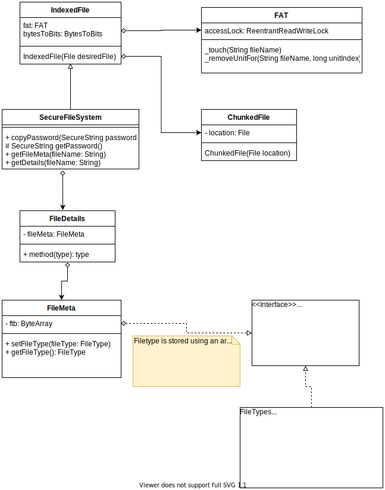
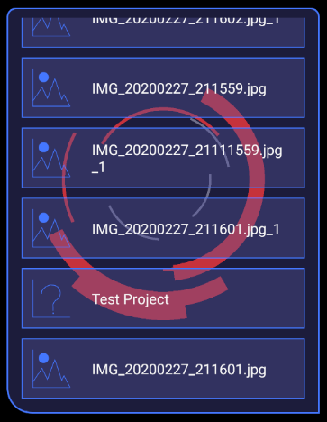

# Mobile Secure Storage

**Table of Contents**

[Project Purposes](#project_purposes)

[General Design](#general_design)

[Containers](#containers)

[Components](#components)

<a name="project_purposes"></a>
## Project Purposes
This project allows me to investigate storing and working with encrypted data in a mobile environment.  It contains various simple demonstration applications, such as notes, projects, and a camera app.  The project utilizes RxJava to allow for asynchronous encryption and decryption of data.  It also makes use of simple MVP design patterns to allow me to create re-usable and testable software components.

This project also allows me to learn more about newer versions of Java / write desktop apps that can leverage the encryption container files/build UI's.

Below you will find general designs as well as additional details on interesting areas of this codebase.

<a name="general_design"></a>
## General Design

### Persistence



### File Explorer
This is the framework I hope to use/extend for defining a general purpose file explorer.  

Currently the screen looks like this:


Eventually I want to do stuff like rename/delete files as well as possibly create directories for them.


#### Registering your Own Icons
You can use the FileTypeDisplayExtender class to register icons for specific file types.  Generally you should add code to do this to your app's `onCreate()` method.

## Adding to the Project
This project relies heavily on the MVP (Model View Presenter) design pattern.  This allows me to develop interactors for all workflows and use cases.  These
interactors should be able to exist independently of the platform in which they are being used.

### Defining a Use Case
First develop interactors that will execute the business logic.  Ideally these should only be aware of the SFS technology and whatever types of data they need in order to function.  It would be preferable
for interactors not to need to know about the Rx library.  This will let you more easily unit test them without needing to rely on complicated integration tests.

### Calling the Interactors
Because the system relies on the MVP design pattern you will need to define a model that will orchestrate the use of the interactors.  The model itself should be usable
in an asynchronous manner.  Prefer using the computation threads for most work involving the model.

For example, consider the picture viewer model below:

```
    fun loadImageForDisplay(fileName: String): Single<Bitmap> {
        return Single.create(SingleOnSubscribe<ByteArray> {
            val gallerySettings = getGallerySettings()
            gallerySettings.currentFile = fileName
            saveGallerySettings(gallerySettings)
            it.onSuccess(imageFilesInteractor.loadImageBytes(gallerySettings.currentFile!!))
        })
                .subscribeOn(Schedulers.computation())
                .flatMap { imageBytes ->
                    androidImageInteractor.convertByteArrayToBitmap(imageBytes).observeOn(AndroidSchedulers.mainThread())
                }
    }
```

This method loads the image with the given filename for display.  It schedules the operation to run on the computation schedule.
